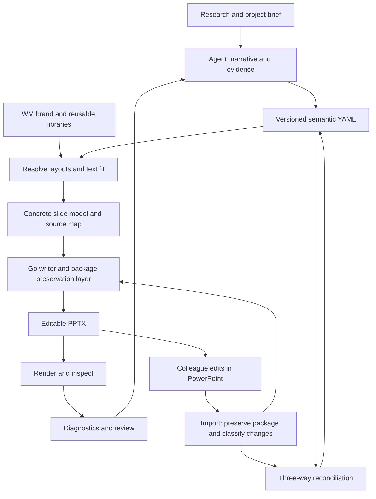

# Product and architecture plan

2026-09-25 · Proposed design · First benchmark: detailed proposal/document-style decks

See [CAPABILITIES.md](CAPABILITIES.md) for the implementation inventory and verified baseline, [DESIGN_WORKFLOW.md](DESIGN_WORKFLOW.md) for catalog and design-pass details, and [planning/README.md](planning/README.md) for the supplied benchmark. All commands, schemas, package names and thresholds below are proposals, not existing capabilities.

**Current execution sequence:** [IMPLEMENTATION_PLAN.md](IMPLEMENTATION_PLAN.md)
incorporates the completed reconstruction, underline and highlight experiments
and prioritizes library inventory, curation, semantic adaptation and revision.
It supersedes the original implementation sequence below.

## Product outcome

An agent can turn source material into a coherent West Monroe proposal deck, generate editable PowerPoint slides, explain and correct quality problems, and resume work after colleagues edit the PowerPoint directly. A deck project retains evidence, design choices, approved assets and version history, so subsequent revisions are controlled and reviewable.

Success is measured by reading quality, design quality, editability, and revisions preserved. XML fidelity to the upstream library remains a regression tool, but does not define the finished product.

The initial profile is a detailed document deck: understandable without narration, with informative titles, supporting explanation, readable tables and diagrams, and traceable sources. The concrete success target is recreating **all 120 slides** in the supplied EnableComp and UHG proposals as editable presentations, including the 12 hidden EnableComp slides. The full **166-slide Graphics and Layouts deck** must become discoverable and acquire reviewed usage/capacity contracts. Stock slide copying alone establishes preservation, not generative recreation. Live-presentation and executive-summary profiles can reuse the same content model while changing density and composition.

## Architecture decisions

| Decision | Recommendation | Reason / tradeoff |
|---|---|---|
| Existing Go writer | Keep `pptx/` as the generated-content engine | It is substantial and tested. Introduce product features above it instead of embedding narrative behavior into XML routines |
| Agent versus CLI | Agent owns synthesis and design judgment; CLI owns repeatable operations and diagnostics | Model/provider independence; the compiler must never invent or silently rewrite a claim |
| Source format | Versioned semantic YAML compiled into a concrete slide model | Authors edit claims, evidence and named slots without maintaining every coordinate |
| Imported documents | Preserve original package parts alongside semantic YAML | Arbitrary PowerPoint documents cannot reliably be reconstructed from a small schema |
| Branded output | Versioned brand packs, with WM as the first full pack | Visual tokens, native templates, voice examples and rules can evolve together |
| Reuse | Distinct assets, components, layouts and content slides | Their approval, content-binding and revision semantics differ |
| Rendering | Pluggable renderers; PowerPoint acceptance for the initial user environment | LibreOffice can provide fast previews, but renderer disagreement must remain visible |
| Storage and discovery | Files/manifests as authority; SQLite FTS5 as the unified local catalog | Search across assets, components, layouts, example content, design guidance and voice; rebuildable index and portable source |
| YAML dependency | Use a maintained parser after a focused dependency decision | Go has no standard YAML parser. Keep the existing writer dependency-free if useful; do not handwrite a YAML parser merely to retain the historical stdlib-only rule |



### Proposed boundaries

- `cmd/pptxgengo`: thin CLI, JSON diagnostics, exit status, version and capabilities
- `internal/spec`: schema, strict validation, migrations and stable identifiers
- `internal/compose`: component/layout resolution and compiled slide model
- `internal/measure`: font-aware estimates, constraints and renderer calibration
- `internal/library`: manifests, SQLite catalog, asset selection, content bindings and approval metadata
- `internal/opc`: package parts and relationships; dependency-aware copy and preservation
- `internal/importer` and `internal/reconcile`: extraction, capability classification, identity matching and merge
- `internal/qa`: structure, geometry, content and rendered checks
- `internal/render`: PowerPoint/LibreOffice adapters with explicit environment metadata
- `skills/`: entry skill plus focused authoring, revision, library and QA references
- Brand packs: installed separately, pinned by version/hash; WM templates and private assets need not be embedded in the general executable

Share one schema and one diagnostic model across these boundaries. Keep document editing and package preservation distinct from generation so unsupported content does not disappear during a rebuild.

## The content and design model

### Narrative before coordinates

The brief records audience, purpose, decision sought, reading mode, desired depth and source documents. Each substantive slide records:

- Its takeaway or claim, and its role in the deck's argument
- Evidence with source ID, location and validation state; assumptions clearly distinguished from facts
- The explanation the reader needs to understand the evidence
- A suitable proof object: chart, comparison, table, process, timeline, diagram, or sourced exhibit
- Detail that belongs on this page versus the appendix or notes

A proposal profile should support a story such as client situation → desired outcomes → recommended approach → scope and deliverables → workplan → responsibilities and dependencies → commercial assumptions → next decision. Include only sections appropriate to the engagement; absence of facts must yield a visible open item, never invented fees, credentials or impact numbers.

Voice needs examples of strong and weak slides, plus the corresponding source passage and rationale. Distill approved examples into guidance about precision, terminology, sentence structure, emphasis and level of detail. The current action-title rules are a starting point. Evaluate title accuracy against evidence: a grammatical full sentence can still overstate the finding.

Document-style decks should preserve explanatory detail. Split by distinct ideas, move secondary evidence into the appendix, or choose a denser approved layout when needed. Never silently truncate content or reduce body text to footnote size to make a slide fit.

### Four reusable libraries

| Library | Stored artifact | Contract |
|---|---|---|
| Asset | Photo, icon, logo, illustration, font | Stable ID, source/hash, file variant, dimensions, aspect ratio, crop/focal point, meaningful description, applicable usage metadata |
| Component | Card, metric block, evidence rail, diagram node | Named slots; padding; allowed fonts/styles; line/item budgets; minimum size; permitted variants; grouping/editability |
| Layout | Reusable slide arrangement | Named zones, accepted component types/cardinality, safe regions, alignment anchors, grid/gutters, capacity and fallback layouts |
| Content slide | Approved slide with meaningful existing content | Original PPTX plus dependency graph, preview, source provenance, approval/version/expiry, fields allowed to change and their bindings |

Curate all 166 slides in the supplied Graphics and Layouts deck. It differs from the installed skill's older 179-slide reference: retain both identities and use the supplied deck as the primary stock-design corpus. A source slide can supply a reusable layout without its business claims becoming reusable content. Revising an approved content slide produces a derivative with a new review state.

Unify the existing 1,331-entry inventory with `/Users/rscott/Documents/branding` through the catalog. Deduplicate overlapping sources by hash and group format/color variants under a shared concept ID; inspect selected assets and enrich the assets used in the pilot first. Index the local design/voice Markdown by heading. Pin local bytes in a content-addressed cache and record hashes so a remote asset change cannot silently change a deck. Add semantic/vector search only if full-text search and tags prove inadequate.

### Capacity is a contract, not one character count

Expose character and item budgets to agents as planning hints, paired with actual font metrics, available dimensions, paragraph spacing, margins and maximum lines. A short string of wide characters may overflow before a longer string of narrow ones. Mixed emphasis, bullets and non-ASCII text also affect fit.

Resolve geometry in one unit system (EMU internally; explicit inches and points at authoring boundaries). Compute from anchors and gutters. Check transformed group bounds, text insets, rotated objects and intentional overlaps. Decorative overlap must be declared so it does not trigger the same rule as two colliding labels.

Use Arial per the supplied corporate PowerPoint guidance. The older skill's titles 24–32pt, body 12–16pt and captions 9–11pt are candidate generation defaults. The actual proposal corpus includes smaller explicit text sizes: preserve source typography in the reconstruction experiment, and assess any readability improvements separately. Resolve inherited styles and view the slides before setting final role-specific thresholds. Preserve approved native frame text as an explicit exception where necessary.

Fit failures should return diagnostics such as: slide/object ID, source YAML path, measured/estimated capacity, violated rule and available fixes. The agent chooses between shortening, a different layout, a larger zone, or another slide. Meaning-changing edits stay visible in source diffs. After a bounded repair loop (initially three attempts), retain unresolved issues for review rather than declare success.

### Illustrative semantic source

```yaml
schema_version: 1
deck_id: proposal-example
profile: document-proposal
brand: west-monroe@1
sources:
  - id: research-01
    path: sources/research.md
slides:
  - id: delivery-approach
    claim: Three workstreams establish the operating model before rollout
    layout: wm.three-workstreams@1
    evidence:
      - source: research-01
        locator: "Delivery approach"
        status: proposed
    slots:
      workstreams:
        - id: governance
          heading: Governance
          body: Define decision rights, accountable owners, and escalation paths
        - id: process
          heading: Process
          body: Document the service workflow and validate handoffs with operators
        - id: enablement
          heading: Enablement
          body: Prepare role-specific guidance and confirm rollout readiness
```

This example is synthetic. Exact schema and identifiers should be settled in the first implementation slice, including how rich text and editable charts bind to slots. Layout manifests carry geometry, not the narrative source file.

## Revision and PowerPoint re-entry

### Preserve both kinds of authority

Before handoff, YAML is authoritative for managed content. At handoff, save the source, compiled bindings, asset lockfile and exported PPTX together as an immutable baseline. After colleagues edit it, the returned PPTX is evidence of their changes. Extract those changes and reconcile them with the current source before making a new baseline.

The project directory should contain readable YAML plus a package store: original/returned PPTX files, part manifests, media and source maps. Large binary files can be stored outside Git or through Git LFS while manifests and YAML remain reviewable. The project must be self-contained once required assets are cached.

### Two import modes

1. **Our generated deck:** stable deck/slide/component/object IDs map edits back to semantic fields. Store mappings in a sidecar and an embedded metadata mechanism selected through experiment. Shape names are helpful but insufficient: colleagues can rename, duplicate, delete or replace shapes, and applications may strip extensions.
2. **Arbitrary external deck:** preserve it, extract structural YAML, inventory objects and propose semantic mappings with confidence. Do not claim to recover original narrative intent, component boundaries, or layout rules automatically. Gradually adopt supported slides/objects into managed form.

Every imported object receives a capability state: editable in our model; preserved but opaque; or unsupported for the requested operation. Unsupported conversion is reported, never silently dropped. A whole-slide preservation mode is a useful fallback, with clear limits on what the CLI can modify. A screenshot can be a preview; it is not a substitute for preserving the editable original.

### Reconcile with a three-way merge

Compare the handed-off baseline, current YAML changes, and the returned PowerPoint. Match stable IDs first; if those are lost, use part relationships, object type, text and geometry as evidence. Require review for ambiguous matches and duplicated identities.

- One-sided changes can be applied automatically if the object is supported
- Equivalent changes coalesce
- Divergent changes to the same content become explicit conflicts
- Text, rich formatting, placement, chart data, notes and slide ordering are tracked separately
- Additions, deletions, duplicate slides, split/merged text boxes and imported slides are represented explicitly
- A user-selected acceptance policy may prefer colleague formatting; never infer that all formatting is disposable

Successful reconciliation writes a new project version and a change report. It does not overwrite the baseline, returned file, or unresolved changes. Re-running a completed import should be idempotent.

### Package preservation requirements

Copying a slide requires its dependent parts and relationships. Microsoft documents how slide, layout and master parts are associated in [Working with presentation slides](https://learn.microsoft.com/en-us/office/open-xml/presentation/working-with-presentation-slides). The implementation must also account for media, charts and embedded workbooks, notes, fonts, comments, hyperlinks and internal slide links, theme dependencies, and unsupported extension parts where encountered.

Model an OPC relationship graph with cycle handling, part-name/relationship-ID remapping, content types and package-level registrations. Preserve original bytes for untouched parts where possible; retained dependencies and themes must remain coherent. Cloning needs an explicit keep-source-formatting versus adopt-destination-brand policy. Adopting the destination brand is a transformation requiring QA.

The first fidelity experiment should precede a broad importer implementation. If a native Go package-preservation path cannot meet it within a bounded spike, compare an Open XML SDK helper or a native PowerPoint operation behind the same CLI boundary. Document deployment and platform costs before selecting a fallback.

## CLI and agent skill pack

Proposed commands, introduced incrementally:

| Command family | Purpose |
|---|---|
| `version`, `capabilities`, `doctor` | Machine-readable versions, supported object operations, installed fonts/renderers and missing dependencies |
| `init`, `validate`, `build` | Create a deck project, validate semantic source and compile editable slides |
| `library search`, `library inspect`, `library add` | Discover, inspect and curate assets/components/layouts/content slides |
| `render`, `qa` | Produce previews/contact sheets and structured findings with locations |
| `inspect`, `import` | Inventory a PPTX and create a preserved package plus structural/semantic YAML |
| `diff`, `reconcile` | Compare versions, surface conflicts and create a revised project |
| `export` | Emit the PPTX with a build manifest and QA status |

Use strict schema validation, actionable error codes and versioned JSON output. Separate logs from machine-readable stdout. Provide useful exit statuses for invalid source, QA failures, conflicts and missing environment requirements. Mutating operations support a preview/diff and atomic new outputs. Avoid shell commands embedded in deck YAML.

The entry skill should be short: identify authoring versus revision, discover installed capabilities, choose the deck profile, and follow the appropriate workflow. Load reference material on demand:

- Story and source synthesis, with document-proposal examples
- WM brand pack and reusable library selection
- Build/render/QA loop and diagnostic repair recipes
- Import, reconciliation and conflict handling
- Curating new assets, layouts and slides

Ship realistic examples and expected artifacts with compatible CLI/schema/brand-pack versions. Run at least two agents independently through the same tasks during evaluation to expose ambiguous instructions. The first implementation need not orchestrate multiple agents; each agent should be able to finish using the CLI and pack alone.

## Experiments and acceptance gates

These are proposed thresholds to calibrate with the first accepted decks, not reported results. Use a fixed corpus, preserve every output and record tool/renderer/font/brand versions. Evaluate raw output and repaired output separately, with elapsed time, repair attempts and human edit counts. Re-run the same inputs for three independent agent attempts where narrative/design judgment is involved.

| Experiment | Inputs and comparison | Pass condition / decision |
|---|---|---|
| E0: Baseline and branch recovery | Existing Go tests; inspect/apply eligible changes from `a26d4712`; representative WM media/theme fixtures | Build/race tests pass; each recovered fix has a targeted assertion; no claim of visual approval from XML tests alone |
| E1: Native template and reuse fidelity | Two-slide WM frame plus ~12 curated reference slides covering text, grouped diagrams, charts, pictures, notes, links, multiple masters and the observed OLE objects; no-op save and cross-deck copy | All package links resolve; zero unexplained content loss or PowerPoint repair prompts; no-op visuals unchanged within calibrated raster noise; all differences reported. This gates the preservation architecture |
| E2: Fit and layout contracts | ~40 authored edge cases: short/long text, wide/narrow glyphs, bullets, mixed styles, long URLs, Unicode, table spans, footers, missing fonts and group transforms | Every seeded overflow caught; no silent truncation; zero final clipping or footer collision on accepted slides; <=10% false positives on clean corpus. Record estimator-versus-renderer disagreement |
| E3: Proposal narrative and voice | Supplied EnableComp/UHG proposals as style examples plus source packets for a new narrative; compare direct source-to-slides against an explicit narrative stage | Zero unsupported factual claims; complete source mapping for material claims; reviewer scores >=4/5 for accuracy, standalone clarity, voice and appropriate detail; compare median repair effort over three attempts |
| E4: Visual alternatives | Same 6-slide narrative and facts, using restrained editorial, diagram-led and photography-led WM treatments | Reviewer chooses based on readability, relevance, hierarchy and deck rhythm; all variants meet brand/fit gates. Test styles within the brand before considering additional brands |
| E5: Asset and library selection | ~20 realistic queries; compare filename search against enriched tags/previews; inject missing, changed and unsuitable assets | Suitable asset in top five for >=80% of curated queries; hashes pinned; missing assets fail clearly; correct aspect ratios and SVG/fallback rendering verified |
| E6: Colleague return | Edit a generated 10-slide deck in PowerPoint: text/runs, notes, chart values, moves, reorder, add/delete/duplicate slide, new objects, changed theme, unsupported SmartArt; add a conflicting YAML edit | 100% of supported seeded edits recovered; no silent losses; opaque content preserved; ambiguous matches and the intentional conflict surfaced; no-op import/re-export visually stable; second import idempotent |
| E7: Agent usability and packaging | Clean checkout/environment and packaged skill; two agents independently build then revise a proposal | Both complete documented path without hidden local paths or undocumented steps; outputs include PPTX, source, manifest, previews and QA; record intervention count and time |
| E8: Complete reconstruction | All 35 EnableComp and 85 UHG slides, indexed individually in the reconstruction ledger | 120/120 accounted for, including hidden slides; same material content, numerical values and hierarchy; preserved native editability where source permits; all special/opaque objects explicitly handled; every slide rendered and reviewed; controlled content changes rebuild without clipping. No screenshot-only recreation or wholesale slide copy counted as generation |
| E9: Complete stock library | All 166 Graphics and Layouts slides, plus their 33 native layouts | Each has preview, source hash, reviewed purpose/tags, editable zone bindings, tested capacity/fallback, dependency/preservation policy and a successful content-change example; variants and reference-only items explicitly classified |

QA is layered:

1. **Package:** XML/relationship integrity, identity uniqueness, chart/workbook consistency and required parts
2. **Geometry and typography:** containment, fit, alignment, safe zones, font resolution and explicit brand exceptions
3. **Rendered:** clipping, substitutions, crops, contrast and actual frame appearance on every slide
4. **Editorial:** evidence accuracy, slide-to-slide logic, voice, reading depth and layout rhythm

Human approval of narrative/design stays distinct from automated checks. A model visual review can propose findings but should not be the sole proof of no clipping. Compare rendered geometry and structured diagnostics, then inspect the contact sheet and full-size slides. Store the renderer identity; PowerPoint and LibreOffice pixels need not match each other to establish a regression within one renderer.

## Original implementation sequence (superseded)

### Phase 0 — Establish the baseline

Go 1.27.1 update and current build/race checks are complete. Next, review the newer branch, correct project-facing Go documentation, and establish a small fixture corpus and renderer adapter. Preserve upstream code/golden fixtures for reference. Add Go CI and deliberate platform coverage when implementation starts.

### Phase 1 — Prove both authoring and re-entry

Build the smallest vertical slice: one document-proposal profile; the WM frame; four reusable layouts (claim/evidence, scope table, workplan, pod/team composition); schema v1; stable IDs; `build`, `inspect`, `render`, and `qa`. Establish the SQLite catalog over all structurally inventoried source items, with explicit readiness states. In the same slice, preserve a generated deck, accept a colleague text edit, and map it back into YAML while retaining an opaque object. Run E1 and the narrow text-edit part of E6 early.

Exit: a 10-slide proposal can be built, viewed, edited in PowerPoint, re-imported and rebuilt with that edit intact. If preservation fails, resolve the engine/adapter choice before expanding the layout library.

### Phase 2 — Make quality repeatable

Add component capacity rules, font measurement, structured QA diagnostics and the initial bounded repair workflow. Calibrate the document profile, narrative examples and source traceability. Run E2–E4. Exit: accepted proposal slides meet fit and editorial gates across repeated attempts.

### Phase 3 — Curate useful reuse

Add asset inventory/cache integration, initially ten approved layouts, five reusable components and a small set of approved content slides. Implement dependency-aware slide reuse and versioned bindings. Expand until all 166 stock slides have reviewed classifications and contracts, with reference-only/non-layout items explicitly identified. Run E5/E9 and broaden E1. Exit: the agent can explain why it selected a reusable item and change bound content without damaging the design.

### Phase 4 — Expand collaboration fidelity

Add full three-way reconciliation for the supported object set; broaden arbitrary-deck import, preservation reporting and review flows. Run the complete E6 corpus, including conflicting changes and unsupported features. Complete E8 across the 120 proposal slides. Publish a support matrix by operation: inspect, preserve, edit, regenerate. Exit: all declared supported edits meet the recovery gate and all other cases are explicit.

### Phase 5 — Distribute and evaluate the pack

Release versioned CLI binaries, schema, skill references and separately installable brand packs. Add `doctor`, migrations, clean-environment checks and an agent evaluation corpus. Run E7. Expand to live/executive profiles only after the document-proposal benchmark is reliable.

## Initial inputs and unresolved decisions

The presentation profile and exemplars are decided: detailed proposal/document decks, represented by EnableComp and UHG. The supplied Graphics and Layouts deck and local branding folder are primary design inputs. Structural inventories and per-slide ledgers exist. Subsequent source-derived reconstruction and accent experiments are documented in [the results report](planning/RECONSTRUCTION_CHECKPOINT.md); these establish a bounded native reuse path, not general new-content generation. A separate substantive source packet is still needed to evaluate new narrative generation independently of reconstruction.

The preservation backend, identity metadata mechanism, text measurement engine and rendering automation remain experimental decisions. Select them using E1/E2/E6 results. The benchmark deliberately brings round-trip fidelity forward because it would be expensive to retrofit after widespread use of generated decks.
